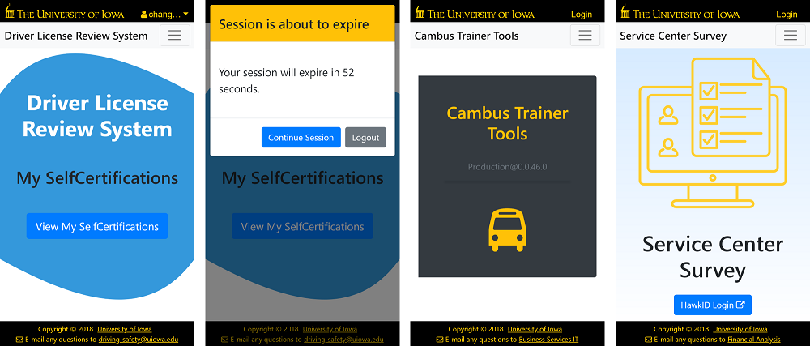

# UIowa Header

An Angular library for common website header, including a UIOWA branding bar and a website nav bar. This library also handles impersonation use case.

You might also want to check out libraries [@uiowa/spinner](https://github.com/changhuixu/spinner) and [session-expiration-alert](https://github.com/changhuixu/session-expiration-alert).

[](https://travis-ci.org/changhuixu/uiowa-header-demo)
[](https://www.npmjs.com/package/@uiowa/uiowa-header)


## [Demo](https://uiowa-header.firebaseapp.com)



Dependencies: Angular 6, ng-bootstrap 2, Bootstrap 4 (css), font-awesome 4.7

## Library Details

### Models

* `ExternalLink`: static link listed in Uiowa branding bar. eg, Employee Self Service site link.
* `InternalRoute`: route for pages in your app.
* `HeaderUser`: used to display user name and/or original user name when impersonation.

### Features

* Responsive header layout with Hawkeye color styles
* Support custom "top-right" part of Uiowa branding bar. By default, "top-right" part of Uiowa branding bar shows External Links (if any) and Login link or User dropdown button. If you want to customize the "top-right" part, you can provide your content inside of `uiowa-header` tag. eg,

```html
<uiowa-header [applicationName]="'My Awesome App'"
              [internalRoutes]="myInternalRoutes">
  <div class="text-white">
    my content
  </div>
</uiowa-header>
```

* Support application Nav menus with dropdown sub menus, as well as dividers in dropdown menu.
* Provide `LoginService` with default implementations for `login()` and `logout()` methods which correspond to click event from login and logout buttons. By default, you don't need to do extra work for login/logout. The two methods follow .NET Core convention redirect to routes `account\login` and `account\logout`, respectively. `LoginService` has a public member `returnUri` (string, default empty), which is the return route after login.

  If you want to customize login and/or logout process, you can provide your customized service via dependency injection. eg,

```typescript
@NgModule({
  imports: [CommonModule, UiowaHeaderModule],
  declarations: [...],
  providers: [{ provide: LoginService, useClass: HawkidLoginService }],
  exports: [UiowaHeaderModule, ...]
})
export class CoreModule {
  constructor(@Optional() @SkipSelf() core: CoreModule) {
    if (core) {
      throw new Error('Core Module can only be imported to AppModule.');
    }
  }
}
```

* When user is impersonating and wants to stop impersonation, user dropdown will show a link which would emit a `stopImpersonation` event. You can handle this event accordingly.

* Follow web content accessibility guidelines.
